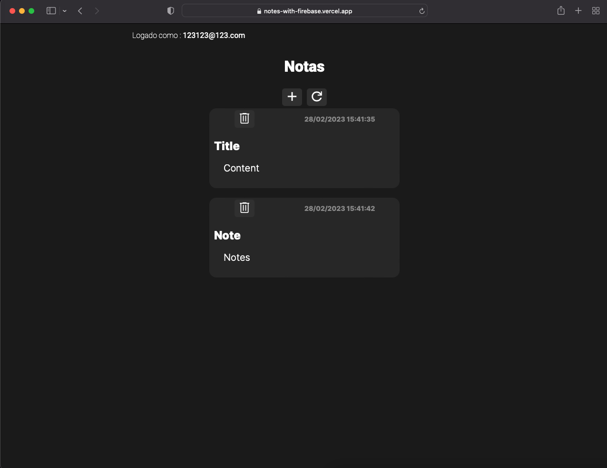
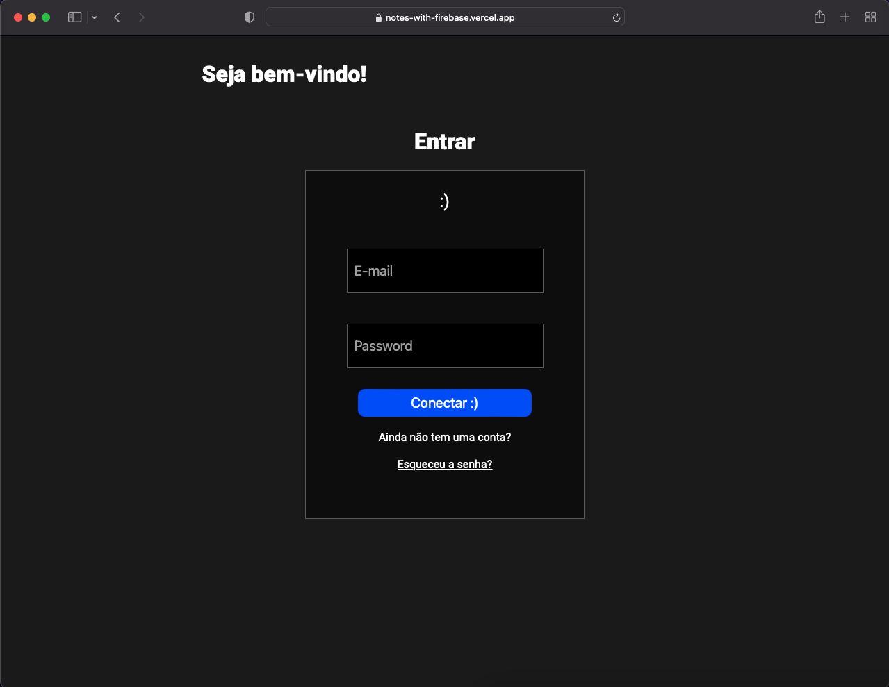

# Notes
Aplicativo para fazer anotações que funciona com autenticação.

### Funcionalidades
<ul>
  <li> O App tem uma lista para selecionar uma de várias raças que estão presentes na API. </ li>
</ul>

### Tecnologias e ferramentas
<ul>
  <li> ReactJS </ li>
  <li> Firebase </ li>
  <li> Firestore </ li>
  <li> Styled-Components </ li>
</ul>

### App
Link para o <a href="https://notes-with-firebase.vercel.app/"> App </a>.

 
